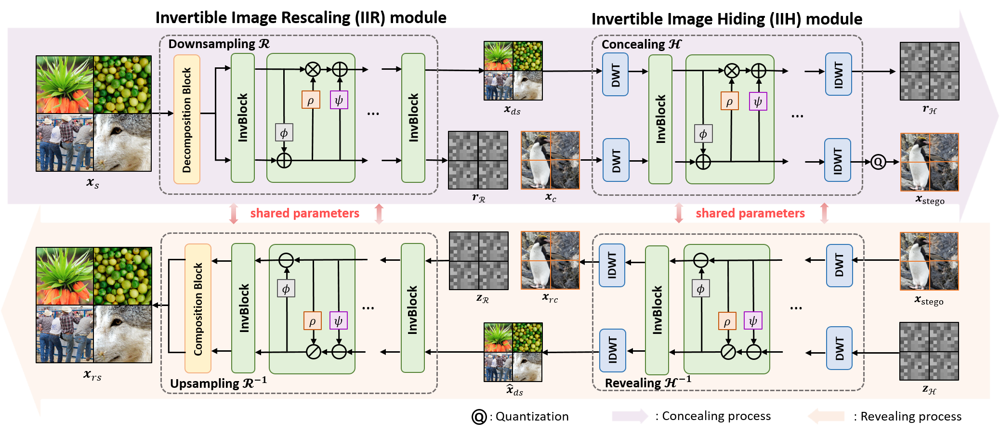
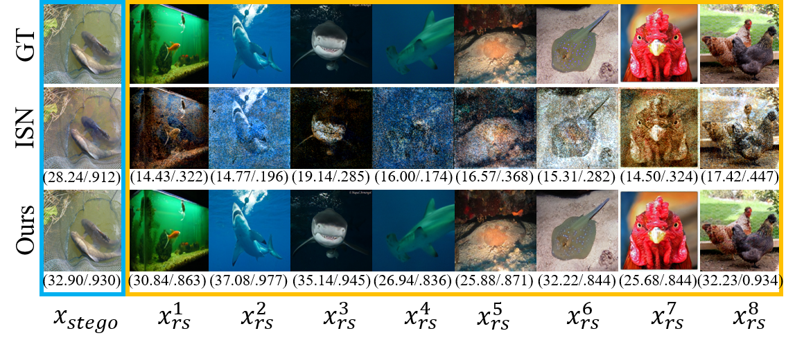

# Invertible Mosaic Image Hiding Network for Very Large Capacity Image Steganography 
[Zihan Chen](https://brittany-chen.github.io/)(chenzihan21@nudt.edu.cn), Tianrui Liu#, [Jun-Jie Huang](https://jjhuangcs.github.io/), Wentao Zhao#, Xing Bi and Meng Wang (#corressponding author)

Pytorch implementation for "Invertible Mosaic Image Hiding Network for Very Large Capacity Image Steganography" (ICASSP'2024).



The existing image steganography methods either sequentially conceal secret images or conceal a concatenation of multiple images. In such ways, the interference of information among multiple images will become increasingly severe when the number of secret images becomes larger, thus restrict the development of very large capacity image steganography. 
In this paper, we propose an Invertible Mosaic Image Hiding Network (InvMIHNet) which realizes very large capacity image steganography with high quality by concealing a single mosaic secret image. InvMIHNet consists of an Invertible Image Rescaling (IIR) module and an Invertible Image Hiding (IIH) module. 
The IIR module works for downscaling the single mosaic secret image form by spatially splicing the multiple secret images, and the IIH module then conceal this mosaic image under the cover image. 
The proposed InvMIHNet successfully conceal and reveal up to 16 secret images with a small number of parameters and memory consumption.
Extensive experiments on ImageNet-1K, COCO and DIV2K show InvMIHNet outperforms state-of-the-art methods in terms of both the imperceptibility of stego image, recover accuracy of secret image and security against steganlysis methods.

<figure class="half">
    
</figure>

## Requisites
- Python >= 3.7
- PyTorch >= 1.0
- NVIDIA GPU + CUDA CuDNN
  
## Dataset Preparation
- DIV2K
- COCO
- ImageNet


## Get Started
### Pretrained models
Download and unzip [pretrained models](https://drive.google.com/file/d/17GRiwaJN8yqmLtiAO-bJcgpG8aWHysz3/view?usp=drive_link), and then copy their path to ```experiments/pretrained_models```. 

### Training for image steganography
First set a config file in options/train/, then run as following:

	python train.py -opt options/train/train_InvMIHNet_4images.yml

### Testing for image steganography
First set a config file in options/test/, then run as following:

	python test.py -opt options/test/test_InvMIHNet_4images.yml

You can choose to conceal and reveal **4, 6, 8, 9, 16 images**.

## Description of the files in this repository
 
1) [`data/`](./data): A data loader to provide data for training, validation and testing.
2) [`models/`](./models): Construct models for training and testing.
3) [`options/`](./options): Configure the options for data loader, network structure, model, training strategies and etc.
4) [`experiments/`](./experiments): Save the parameters of InvMHINet.


## Citation

If you find this code and data useful, please consider citing the original work by authors:

```
@inproceedings{Chen2024InvMIHNet,
  title={Invertible Mosaic Image Hiding Network for Very Large Capacity Image Steganography},
  author={Zihan Chen, Tianrui Liu, Jun-Jie Huang, Wentao Zhao, Xing Bi and Meng Wang},
  booktitle={IEEE International Conference on Acoustics, Speech, and Signal Processing},
  volume={},
  number={},
  pages={},
  year={2024}
}
```

## Acknowledgement
The code is based on [IRN](https://github.com/pkuxmq/Invertible-Image-Rescaling), with reference of [HiNet](https://github.com/TomTomTommi/HiNet).

## Contact
If you have any questions, please contact <chenzihan21@nudt.edu.cn>.
